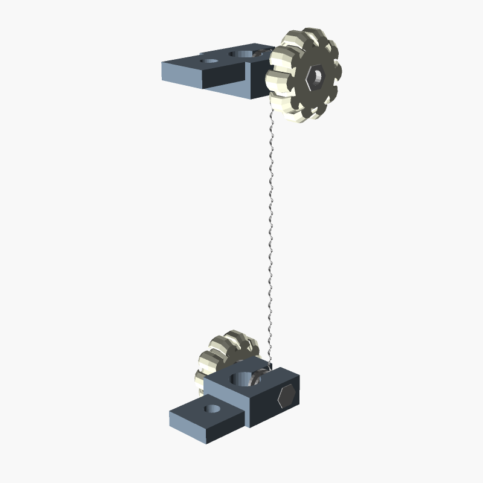

# Scroll saw blade holder
Blade holder for a "Titan TTB411SSW" scroll saw, might also be compatible with a "Shop Fox W1713".
It allows to hold plain scroll saw blades: blades without a "pin end".

I created the holder to use round blades.

Part list to build one:
- 2 x M4 25mm hex head (outer hex)
- 2 x M4 hex nut
- 6 x M4 washer (approximatly 10mm outer diameter)

|blade-mount.scad|nut-handle.scad|preview.scad|
|---|---|---|
||||
